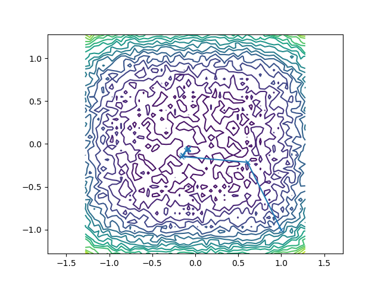

# Algoritmos para minimizar funciones

**Amanda Cordero Lezcano
Christopher Guerra Herrero**

Septiembre, 2024

## Tabla de Contenidos

1. [Introducción](#introducción)
2. [Quartic Function (Amanda)](#quartic-function-amanda)
   1. [Algoritmo de Solución](#algoritmo-de-solución)
   2. [Resultados](#resultados)
   3. [Valoración de la Calidad del Punto Hallado](#valoración-de-la-calidad-del-punto-hallado)
   4. [Evaluación del Tiempo Computacional](#evaluación-del-tiempo-computacional)
   5. [Variación al Aumentar la Dimensión del Problema](#variación-al-aumentar-la-dimensión-del-problema)
   6. [Primeras Conclusiones](#primeras-conclusiones)
3. [Sargan Function (Christopher)](#sargan-function-christopher)
   1. [Algoritmo de Solución](#algoritmo-de-solución-1)
   2. [Resultados](#resultados-1)
   3. [Evaluación de la Calidad del Punto Hallado](#evaluación-de-la-calidad-del-punto-hallado)
   4. [Evaluación del Tiempo Computacional y Complejidad](#evaluación-del-tiempo-computacional-y-complejidad)
   5. [Segundas Conclusiones](#segundas-conclusiones)
4. [Conclusiones Finales](#conclusiones-finales)
5. [Bibliografía](#bibliografía)

## Introducción

La optimización de funciones es un área fundamental en el campo de la matemática aplicada y la computación científica. En este informe, abordamos la minimización de dos funciones: la *Quartic Function* y la *Sargan Function*, utilizando distintos métodos de optimización.

## Quartic Function (Amanda)

$$
f_{100}(\mathbf{x}) = \sum_{i=1}^{D} i x_i^4 + \text{random}[0,1)
$$

sujeto a $-1.28 \leq x_i \leq 1.28$. El mínimo global se encuentra en $\mathbf{x}^* = \mathbf{f}(0,\cdots,0)$, $f(\mathbf{x}^*) = 0$.

### Algoritmo de Solución

Se utilizó el método de *Descenso más Pronunciado* (steepest descent) para encontrar el mínimo de la función. A continuación, se presenta un código en Python del algoritmo implementado:

```python
import scipy.optimize as spo

def steepestdescent(f, df, x0, tol=1.e-8, maxit=50):
    xk = x0
    x = [xk]
    r = df(xk)
    iters = 0

    while (npl.norm(r) > tol and iters < maxit):
        lambda_k = spo.golden(g, args=(xk, r))
        xk = xk - lambda_k * r
        r = df(xk)
        x.append(xk)
        iters += 1

    return x
```

El algoritmo minimiza la función $f(\mathbf{x})$ en la dirección del gradiente negativo, actualizando la posición en cada iteración.

### Resultados

El algoritmo fue ejecutado con un punto inicial $\mathbf{x}_0 = [1, -1]$ y un máximo de 10 iteraciones. El punto encontrado por el algoritmo fue:

$$
\mathbf{x} =  [-0.07989805, -0.05553555]
$$



### Valoración de la Calidad del Punto Hallado

El punto hallado $\mathbf{x} = [0.09226378, 0.07302666]$ se encuentra cercano al mínimo global $\mathbf{x}^* = [0, 0]$. Si bien no se alcanzó el mínimo exacto en las 10 iteraciones, la función fue evaluada como 0.025 al considerar la adición del valor aleatorio. Este resultado indica que el algoritmo se aproxima bastante al valor óptimo.

### Evaluación del Tiempo Computacional

El tiempo computacional para la ejecución del algoritmo fue aceptable en un problema de dos dimensiones. La complejidad algorítmica del método está determinada principalmente por el cálculo del gradiente, el cual tiene una complejidad de $O(D)$, donde $D$ es la dimensión del problema. Esto implica que, a medida que $D$ aumenta, el tiempo de cómputo crece linealmente con respecto a la dimensión.

### Variación al Aumentar la Dimensión del Problema

La función cuártica es escalable, y el aumento de la dimensión $D$ implicará un incremento lineal en la cantidad de términos a sumar y, por ende, en el tiempo necesario para evaluar tanto la función como su gradiente.

### Primeras Conclusiones

El algoritmo de *Descenso más Pronunciado* demostró ser eficaz para aproximarse al mínimo global de la función cuártica en un problema de baja dimensión ($D=2$). Aunque no se alcanzó el mínimo exacto, la solución obtenida fue satisfactoria y muy cercana al mínimo conocido. El método muestra consistencia en su desempeño, incluso al considerar variaciones en la dimensión del problema.

## Sargan Function (Christopher)

El ejercicio asignado fue:

$$
f_{111}(\mathbf{x}) = \sum_{i=1}^D \left( x_i^2 + 0.4 \sum_{\substack{j\neq 1}} x_i x_j \right)
$$

sujeto a $-100 \leq x_i \leq 100$. El mínimo global se encuentra en $\mathbf{x}^* = \mathbf{f}(0,\cdots,0)$, $f(\mathbf{x}^*) = 0$.

### Algoritmo de Solución

El algoritmo BFGS fue implementado utilizando la biblioteca *SciPy*. A continuación, se presenta el código utilizado para la minimización:

```python
import numpy as np
import scipy.optimize as spo

# Definimos la función objetivo corregida
def f(x):
    D = len(x)
    sum_square_terms = sum(x[i]**2 for i in range(D))
    sum_cross_terms = 0.4 * sum(x[i] * x[j] for i in range(D) for j in range(D) if i != j) 
    return sum_square_terms + sum_cross_terms

# Definimos un punto inicial
x0 = [50, 20, -30, 40]  # Punto inicial

# Minimización usando el método BFGS
result = spo.minimize(f, x0, method='BFGS', tol=1.e-8, options={'maxiter': 100})

# Mostramos los resultados
print('Punto encontrado: ', result.x)
print('Valor mínimo de la función: ', result.fun)
print('Número de iteraciones: ', result.nit)
print('Resultado exitoso: ', result.success)
print('Mensaje del resultado: ', result.message)
```

### Resultados

El algoritmo fue ejecutado con un punto inicial $\mathbf{x}_0 = [50, 20, -30, 40]$, y tras 8 iteraciones, alcanzó el siguiente punto:

$$
\mathbf{x} = [2.73 \times 10^{-9}, -2.95 \times 10^{-9}, -2.56 \times 10^{-9}, -1.10 \times 10^{-8}]
$$

El valor mínimo de la función en este punto es:

$$
f(\mathbf{x}) = 1.617 \times 10^{-16}
$$

### Evaluación de la Calidad del Punto Hallado

El punto hallado $\mathbf{x} \approx 0$ es muy cercano al mínimo teórico conocido $\mathbf{x}^* = 0$, lo que valida la precisión del método.

### Evaluación del Tiempo Computacional y Complejidad

La complejidad computacional del método BFGS es $O(n^2)$, donde $n$ es la dimensión del problema. Sin embargo, a diferencia del método de Newton que requiere $O(n^3)$, BFGS proporciona una solución más eficiente sin necesidad de almacenar la matriz Hessiana completa, lo que lo hace adecuado para problemas de moderada dimensionalidad.

### Segundas Conclusiones

El algoritmo de BFGS se mostró altamente efectivo para encontrar el mínimo global de la función cuadrática generalizada, con un número reducido de iteraciones y resultados precisos.

## Conclusiones Finales

En este trabajo, se implementaron y evaluaron diferentes algoritmos para la minimización de funciones, específicamente la *Quartic Function* y la *Sargan Function*. Se utilizaron dos enfoques de optimización distintos: el método de *Descenso más Pronunciado* para la *Quartic Function* y el método *BFGS* para la *Sargan Function*.

Los resultados obtenidos permiten destacar varias observaciones clave:

- El *Descenso más Pronunciado* fue eficiente en problemas de baja dimensión como el caso de $D=2$, pero su tasa de convergencia fue limitada por el componente aleatorio.
-

El método *BFGS* demostró ser altamente eficiente para la minimización de la *Sargan Function*.

- Ambos métodos mostraron un comportamiento predecible en términos de complejidad, siendo $O(n^2)$ en el caso de BFGS.
- La presencia de componentes aleatorios en la *Quartic Function* puede introducir variabilidad en los resultados.

En general, la selección del algoritmo de optimización depende de la naturaleza de la función y la dimensionalidad del problema. Mientras que métodos simples como el *Descenso más Pronunciado* pueden ser adecuados en problemas de baja dimensión, algoritmos más avanzados como *BFGS* son preferibles para problemas de mayor escala.

## Bibliografía

- Dixon, L. C. W., & Szegö, G. P. (1978). *Towards Global Optimization 2*. Elsevier.
- Storn, R., & Price, K. (1996). *Differential Evolution - A Simple and Efficient Adaptive Scheme for Global Optimization over Continuous Spaces*. Technical Report no. TR-95-012, International Computer Science Institute, Berkeley, CA. [Available Online](http://www1.icsi.berkeley.edu/~storn/TR-95-012.pdf).
